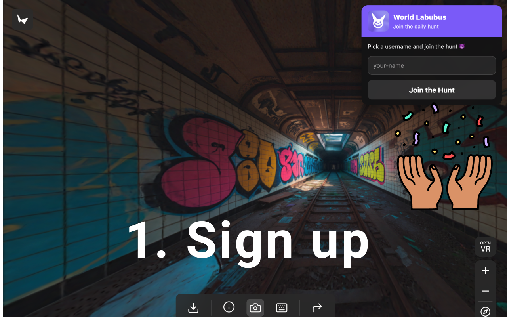
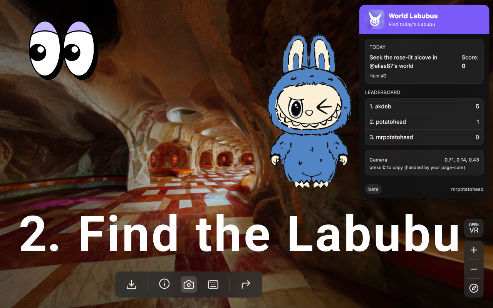
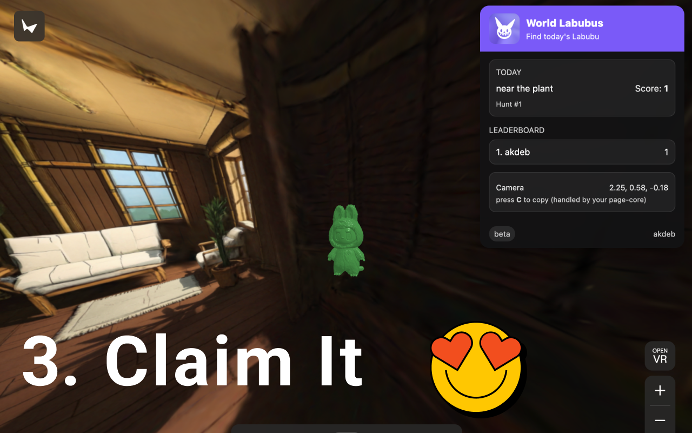
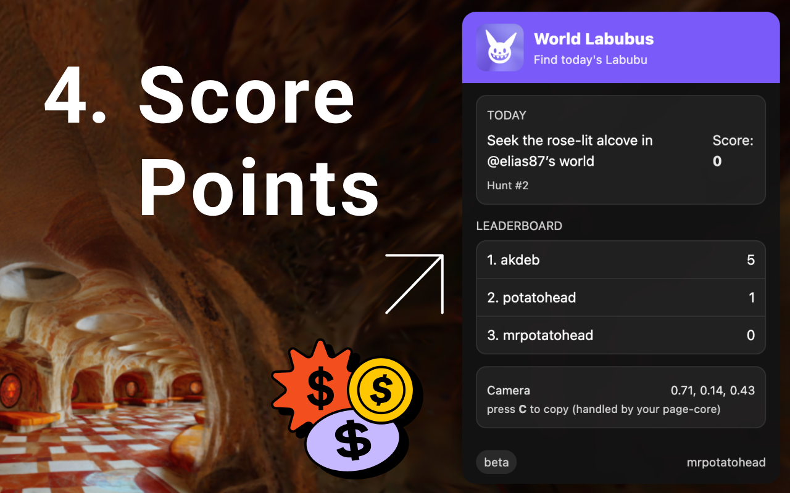

## World Labubus

World Labubus is a daily, Wordle-like game built on [Marble](https://marble.worldlabs.ai) by World Labs — find the hidden Labubu each day with hints, compete on a leaderboard, and enjoy worlds created from images or text.

### Quick demo (3 min)

<iframe
  width="100%"
  height="400"
  src="https://www.youtube.com/embed/WoYWYhJIe_I"
  title="World Labubus demo"
  frameborder="0"
  allow="accelerometer; autoplay; clipboard-write; encrypted-media; gyroscope; picture-in-picture; web-share"
  allowfullscreen
></iframe>

### Add the Chrome extension

Play right from your browser with the World Labubus Chrome extension.

- Install from the Chrome Web Store: https://chromewebstore.google.com/detail/world-labubus/jkhjhjoigkdiinfhnedhoafdncgalgkl

### How it works

- **Daily challenge**: Each day, a new Labubu is hidden in one of the Marble-generated worlds.
- **Guided hints**: You’ll get hints to narrow down the right world — and where Labubu is actually hiding inside it.
- **Competitive play**: A global leaderboard tracks speed and streaks so you can climb the ranks.
- **Chrome extension**: Click and play right from your browser.

### How to play

Swipe horizontally on mobile or use your trackpad/scroll on desktop.

### Leaderboard

Compete with friends and the community. Scores update as you find Labubu; streaks and speed push you up the board.

### Privacy Policy

Minimal data collection — only what’s needed to run the game and leaderboards.

We store the following in Supabase:

1. **users** — `username`, `player_id`, and aggregate score
2. **labubus** — daily Labubu/level metadata (world reference, date, placement info)
3. **finds** — which user found which daily Labubu (timestamped for scoring and streaks)

For questions or deletion requests, please contact us with your `username` and `player_id` so we can find your record.

